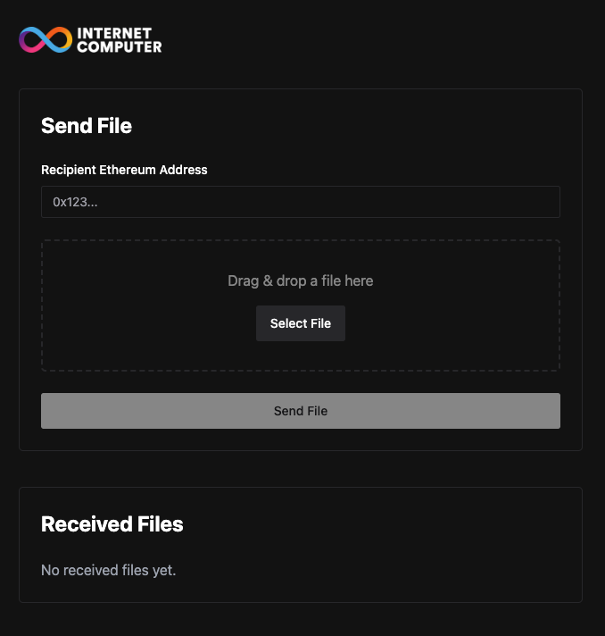

# Send encrypted files to any Ethereum address


This demo application allows you to send encrypted files to any Ethereum address. It uses [Identity-based encryption (IBE)](https://en.wikipedia.org/wiki/Identity-based_encryption) together with the [vetKeys](https://internetcomputer.org/docs/current/references/vetkeys-overview/) (Verifiably Encrypted Threshold Key Derivation) Internet Computer feature.

> **TL;DR** 
> vetKeys on the Internet Computer allow developers to more easily perform encryption, threshold decryption, and signing. **vetKeys allows a public blockchain to hold secrets.**

[![Contributors][contributors-shield]][contributors-url]
[![Forks][forks-shield]][forks-url]
[![Stargazers][stars-shield]][stars-url]
[![Issues][issues-shield]][issues-url]
[![MIT License][license-shield]](LICENSE)


> [!NOTE]
> The vetKeys feature will be available Q2 2025. This demo uses the [chainkey_testing_canister](https://github.com/dfinity/chainkey-testing-canister) to simulate the vetKeys feature.



## Table of Contents
- [Sending a file](#sending-a-file)
  - [Create a transfer](#create-a-transfer)
    - [Get the recipient's public key](#get-the-recipients-public-key)
    - [Encrypt the file in the frontend](#encrypt-the-file-in-the-frontend)
    - [Store the encrypted file in the backend](#store-the-encrypted-file-in-the-backend)
- [Receiving a file](#receiving-a-file)
  - [Getting the private key](#getting-the-private-key)
  - [Decrypting the file](#decrypting-the-file)
- [Run locally](#run-locally)
- [Run frontend in development mode](#run-frontend-in-development-mode)
- [Deploy to the Internet Computer](#deploy-to-the-internet-computer)
- [License](#license)
- [Contributing](#contributing)

## Sending a file

The user signs in using their Ethereum address with the help of the [ic-siwe](https://github.com/kristoferlund/ic-siwe) provider canister and its [support library, ic-siwe-js](https://www.npmjs.com/package/ic-siwe-js).

The sign in process securely establishes a link between the user's Ethereum address and their Internet Identity.

### Create a transfer

The user can create a transfer by specifying the recipient's Ethereum address and the file to send. 

When `Send file` is clicked, this is what happens:

#### Get the recipient's public key

The frontend calls the `vetkd_public_key` method on the `chainkey_testing_canister` to get the recipient's public key. The recipient's Ethereum address is used as the identity for the IBE scheme that generates the public key.

[📄 vetkd_public_key.rs](src/backend/src/vetkd/controller/vetkd_public_key.rs)

```rust
#[update]
async fn vetkd_public_key(address: String) -> Result<Vec<u8>, String> {
    let address = Address::parse_checksummed(address, None).map_err(|e| e.to_string())?;

    let args = VetkdPublicKeyArgs {
        key_id: VetkdPublicKeyArgsKeyId {
            name: "insecure_test_key_1".to_string(),
            curve: VetkdCurve::Bls12381,
        },
        derivation_path: vec![ByteBuf::from(*address.0)],
        canister_id: None,
    };

    let (result,) = chainkey_testing_canister
        .vetkd_public_key(args)
        .await
        .unwrap();

    Ok(result.public_key.to_vec())
}
```

After the vetKeys feature is available, the testing canister call would be replaced with the actual vetKeys call.

#### Encrypt the file in the frontend

The frontend encrypts the file using the recipient's public key. The file is encrypted using the `vetkd.IBECiphertext.encrypt` method from the `ic-vetkd-utils` support package. This package will be available in a new version when the vetKeys feature is available.

[📄 useTransferCreate.tsx](src/frontend/src/transfer/hooks/useTransferCreate.tsx)
```javascript
/// ... 
const response = await backend.vetkd_public_key(recipientAddress);
if ("Err" in response) {
  console.error("Error getting recipient public key", response.Err);
  return;
}

const recipientPublicKey = response.Ok as Uint8Array;
const seed = window.crypto.getRandomValues(new Uint8Array(32));
const fileBuffer = await file.arrayBuffer();
const encodedMessage = new Uint8Array(fileBuffer);
const encryptedFile = vetkd.IBECiphertext.encrypt(
  recipientPublicKey,
  new Uint8Array(0),
  encodedMessage,
  seed
);
const request = {
  to: recipientAddress,
  content_type: file.type,
  filename: file.name,
  data: encryptedFile.serialize(),
};
return backend.transfer_create(request);
```

#### Store the encrypted file in the backend

The backend canister verifies the `from` and `to` parameters and stores the encrypted file. 

[📄 transfer_create.rs](src/backend/src/transfer/controller/transfer_create.rs)

```rust
#[update]
pub async fn transfer_create(args: TransferCreateRequest) -> Result<Transfer, String> {
    let principal_blob = principal_to_blob(ic_cdk::caller());
    let from = UserManager::get(principal_blob).ok_or("User not found".to_string())?;
    let to = Address::parse_checksummed(args.to, None).map_err(|e| e.to_string())?;
    let transfer = TransferManager::create(TransferManagerCreateArgs {
        from,
        to,
        filename: args.filename,
        content_type: args.content_type,
        data: args.data,
    })?;
    Ok(transfer)
}
```

## Receiving a file

A receiveing user logs in with their Ethereum address same as the sender. The frontend calls the `transfer_list` method on the backend to get a list of transfers. The user can then download the encrypted file and decrypt it using their private key.

[📄 useTransferList.tsx](src/frontend/src/transfer/hooks/useTransferList.tsx)

vetKeys on the Internet Computer allow developers to more easily perform encryption, threshold decryption, and signing when building dapps on ICP. It is powered by a protocol called vetKD (Verifiably Encrypted Threshold Key Derivation) that allows to derive decryption keys on demand.

Key derivation on demand
Blockchains are not known for their privacy capabilities. The goal of vetKeys is to ease the burden of using security and privacy tools on the Internet Computer. Encrypting information locally on a device and storing it on a blockchain is easy as the secret key material always remains on the local device and is not exposed. The difficulty arises when a user may want to retrieve the encrypted information from a different device, or share with a different user as there is no straightforward way to pass secret key material across public channels in a privacy-friendly way.

vetKeys leverages the fact that BLS signatures, the native signature scheme on ICP, are unique, and therefore ideally suited (under the right conditions) to be used as cryptographic decryption keys. As BLS signatures are computed in a distributed way on ICP, there is no central authority deriving keys for users. Furthermore, following standard practices in IBE schemes the derived key can be transported to the user in an encrypted manner. As such, nodes and the network never have access to a user’s keys.

The availability of vetKeys allows for a series of applications including but not limited to those covered in the following sections.

End-to-end encryption
The main use case is to enable a blockchain to host threshold-encrypted data in a way that scales to millions of users and billions of secrets, using just a single threshold-shared secret key. BLS signatures are unique, making them immediately useful as symmetric keys.

Think for example of a secure file storage dapp: a user could use the BLS signature on their identity as the root secret under which they encrypt their files before storing them in the dapp. The dapp enforces that only the authenticated user is allowed to recover the root key, and hence decrypt the files. The nodes in the blockchain assist a user in recovering their root key, but never see that key or the content of the files.


### Getting the private key

One of the challenges when doing encryption in an open network like the Internet Computer is how to securely store and retrieve the private key. vetKeys solves this problem by allowing the user to derive the private key on demand. To securely transfer the private key to the requesting user, a transport secret key is used to encrypt the private key while in transfer.

[📄 useVetkdEncryptedKey.tsx](src/frontend/src/vetkd/hooks/useVetkdEncryptedKey.tsx)

```javascript
// ...
const seed = window.crypto.getRandomValues(new Uint8Array(32));
const transportSecretKey = new vetkd.TransportSecretKey(seed);
const response = await backend?.vetkd_encrypted_key(
  transportSecretKey.public_key(),
);
```

Similar to when getting the public key, the backend uses the Ethereum address of the caller as the key derivation path. Also note how the transport secret key is passed to `vetkd_encrypted_key` function to encrypt the private key before returning it to the frontend.

[📄 vetkd_encrypted_key.rs](src/backend/src/vetkd/controller/vetkd_encrypted_key.rs)

```rust
#[update]
async fn vetkd_encrypted_key(encryption_public_key: Vec<u8>) -> Result<Vec<u8>, String> {
    let address = get_caller_address().await?;

    let args = VetkdEncryptedKeyArgs {
        key_id: VetkdEncryptedKeyArgsKeyId {
            name: "insecure_test_key_1".to_string(),
            curve: VetkdCurve::Bls12381,
        },
        public_key_derivation_path: vec![ByteBuf::from(*address.0)],
        derivation_id: ByteBuf::new(),
        encryption_public_key: ByteBuf::from(encryption_public_key),
    };

    let (result,) = chainkey_testing_canister
        .vetkd_encrypted_key(args)
        .await
        .unwrap();

    Ok(result.encrypted_key.to_vec())
}
```

### Decrypting the file

Once in posession of the encrypted private key, the frontend can first decrypt the private key using the transport secret key and then use the private key to decrypt the file.

[📄 useTransferGet.tsx](src/frontend/src/transfer/hooks/useTransferGet.tsx)

```javascript
// ...
const key = transportSecretKey.decrypt(
  encryptedKey,
  publicKey!,
  new Uint8Array()
);
const ibeCiphertext = vetkd.IBECiphertext.deserialize(
  transfer.data as Uint8Array
);
const decryptedData = ibeCiphertext.decrypt(key);
return { decryptedData, ...transfer };
```

## Run locally

```bash
dfx start --clean --background
pnpm i
bash scripts/deploy.sh
```

## Run frontend in development mode

```bash
pnpm run dev
```

## Deploy to the Internet Computer

```bash
bash scripts/deploy-ic.sh
```

## License

This project is licensed under the MIT License. See the LICENSE file for more
details.

## Contributing

Contributions are welcome! Please open an issue or submit a pull request if you
have any suggestions or improvements.

[contributors-shield]: https://img.shields.io/github/contributors/kristoferlund/send_file_to_eth_demo.svg?style=for-the-badge
[contributors-url]: https://github.com/kristoferlund/send_file_to_eth_demo/graphs/contributors
[forks-shield]: https://img.shields.io/github/forks/kristoferlund/send_file_to_eth_demo.svg?style=for-the-badge
[forks-url]: https://github.com/kristoferlund/send_file_to_eth_demo/network/members
[stars-shield]: https://img.shields.io/github/stars/kristoferlund/send_file_to_eth_demo?style=for-the-badge
[stars-url]: https://github.com/kristoferlund/send_file_to_eth_demo/stargazers
[issues-shield]: https://img.shields.io/github/issues/kristoferlund/send_file_to_eth_demo.svg?style=for-the-badge
[issues-url]: https://github.com/kristoferlund/send_file_to_eth_demo/issues
[license-shield]: https://img.shields.io/github/license/kristoferlund/send_file_to_eth_demo.svg?style=for-the-badge
[license-url]: https://github.com/kristoferlund/send_file_to_eth_demo/blob/master/LICENSE.txt

